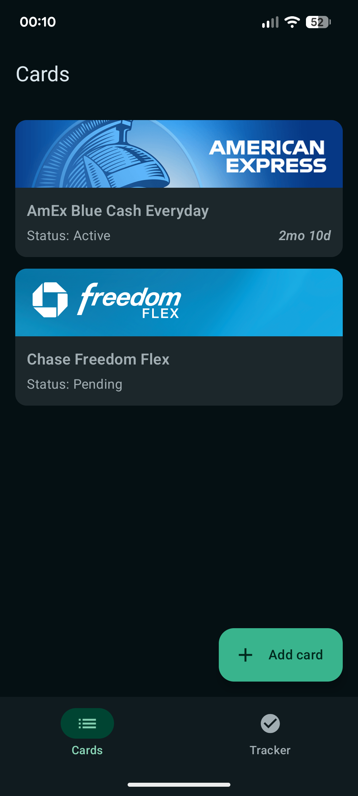
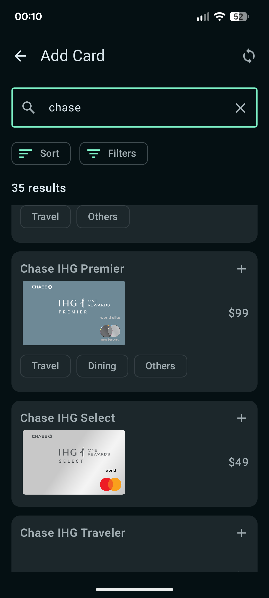
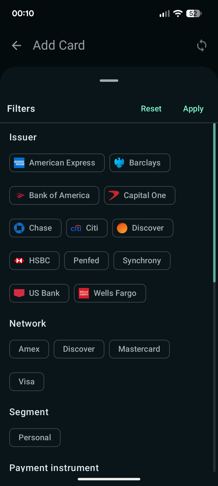
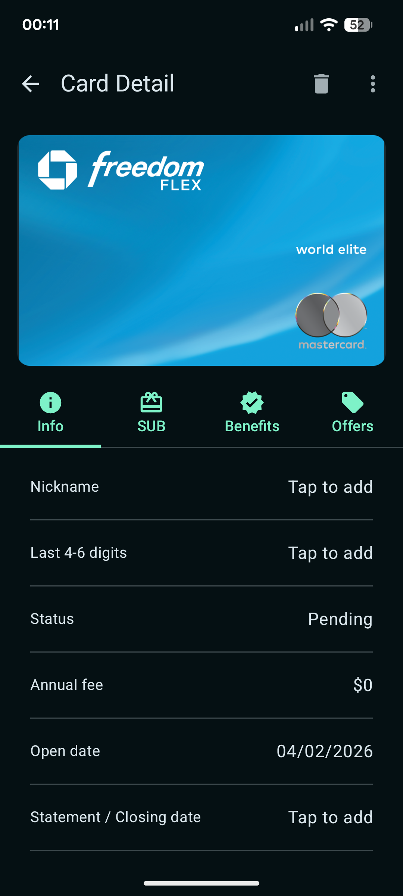
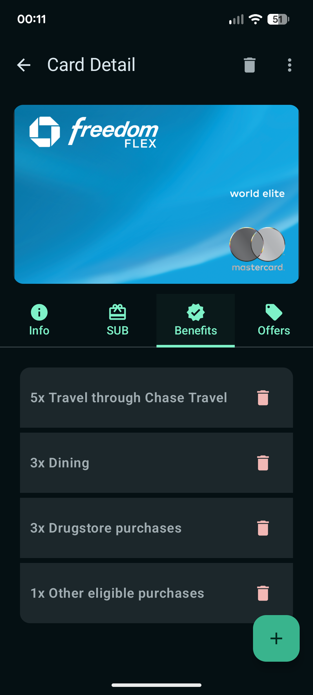

# mReawrds

mReawrds is an Android app for tracking credit cards, their benefits, and time-sensitive actions such as expiring credits, offers, and sign-up bonus progress.

The project is built with Kotlin, Jetpack Compose, Room, and Firebase Firestore sync for card template data. It focuses on helping users manage their card portfolio, review card details, and stay on top of benefit usage through trackers and reminders.

## Screenshots

| Card list | Add card search | Add card filters |
| --- | --- | --- |
|  |  |  |

| Card detail | Card benefits | Card face picker |
| --- | --- | --- |
|  |  |  |
